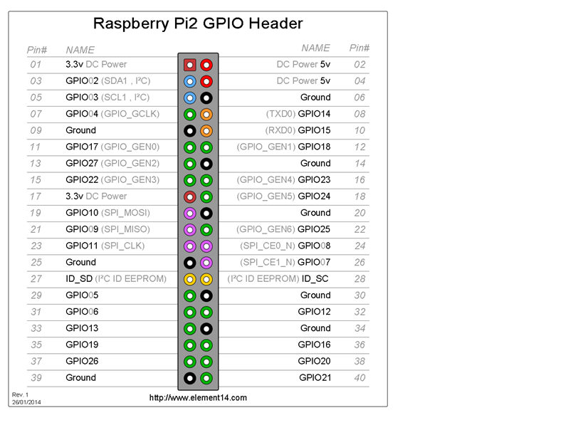

# DJI-Onboard-SDK-Raspberry-Transparent-Transmission

## Intro

This a simple demo for DJI Onboard SDK Transparent Transmission function. Also I run this demo on a Raspberry Pi.

I make this demo to detect PM 2.5 in air. And I believe everyone can obtain his/her own sensor data in the same way.

First, Pi gets sensor data from a PM 2.5 sensor. (I bought one from Taobao, which contains a USB-TTL moudel)

Second, Pi sends the data to M100 for Transparent Transmission.

Finially, the data shows on my phone or pad which is connected with M100's controllor.

>Fly your M100 with RPi instead of expensive NUC !   
>Also Fly your M100 with your own sensors too !

## Requirement

+ M100
+ Raspberry Pi
+ PM2.5 Sensor

## Setup

### 1. Connect Pi and M100  

   As we know, RPi has a serial port with 3.3V. We can use it directly, so there is no need to purchase a USB-TTL model.  

   Here is the definition of M100's serial port.   
  
   And this is the definition of RPI's serial port.
  

   |M100|RPin| 
   |----|----|  
   |RXD  | Tx  (PIN 08)| 
   |TXD  | Rx  (PIN 10)| 
   |GND | GND (PIN 06)|

   However, the serial port of RPi is designed for kernel, therefore we need to configure it.  
   >1. **edit cmdline.txt**  `sudo nano /boot/cmdline.txt`  
   change   
   `dwc_otg.lpm_enable=0 console=ttyAMA0,115200 kgdboc=ttyAMA0,115200 console=tty1 root=/dev/mmcblk0p2 rootfstype=ext4 elevator=deadline rootwait`    
   into  
   `dwc_otg.lpm_enable=0 console=tty1 root=/dev/mmcblk0p2 rootfstype=ext4 elevator=deadline rootwait`

   >2. **edit inittab** `sudo nano /etc/inittab`  
   Invaild the last line `#T0:23:respawn:/sbin/getty -L ttyAMA0 115200 vt100`

   In addition, to use this serial port within 230400 baudrate, we need to change uart clock.
   > **edit config.txt** `sudo nano /boot/config.txt`  
   > Add this in last `init_uart_clock=64000000`

   At last, restart your Pi and we can use `/dev/ttyAMA0` to communicate with M100.

### 2. Connect Pi and Sensor 
  My PM2.5 sensor is driven by a arduino, so this part is sample. I just install arduino for RPi, then I can find my sensor which is `/dev/ttyUSB0`

  In other cases, this part depends your specific sensors.

### 3. Code (DJI Onboard SDK Part)

  I use `DJI_LIB` to develop the Onboard Part. All I need to do is call relative function to init Onboard SDK and send my data.

  BTW: you can find `DJI_LIB` in Samples of DJI Onboard SDK. 

  Here are some tips for coding.

  +  After call `Pro_Hw_Setup("/dev/ttyAMA0", 230400)` to open serial port, do not forget call `DJI_Pro_Setup(NULL);`.
  +  If you want to use Transparent-Transmission to send data to mobile device, activation is nescessary. Both level 1 & 2 are ok. (I have hidden my app_key & app_id, just edit it into yours)
  +  Add `DJI_LIB` files name into `Makefile` to ensure they will be compiled and linked correctly.
  +  `pm25.cpp` is the interface of PM2.5 sensor, which is a serial port. 

### 4. Code (DJI Mobile SDK Part)
  TODO
### 5. Compile & Run  
copy `pm25` folder into your Pi.
Then execute the following cmd. 
  `cd cmake`  
  `make`  
  `cd ../output`  
  `./pm25`  
The terminal should be like this.
~~~
Acttivation Successfully

0.0,25.0,59.8
[pure_transfer],send len 15 data 0.0,25.0,59.8

0.5,25.0,59.8
[pure_transfer],send len 15 data 0.05,25.0,59.8

0.9,25.0,59.8
[pure_transfer],send len 15 data 0.9,25.0,59.8
~~~
Run the App by Mobile device.
This is a sample App, but you can see the date has been received.